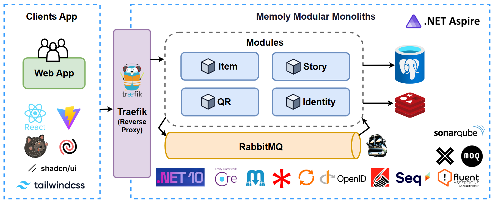

# Memoly

Turn every lifeless object into a living diary page with a smart management system.

## Overview

**Memoly** is an app that lets you attach stories and memories to physical objects through QR codes. Every item — an old medal, a rare book, a keepsake — carries a story. Memoly helps you preserve and pass those stories on to yourself and future generations.

## Architecture



## How It Works

1. **Register** — Take a photo of the item, enter its details, and write the story behind it. You can also upload related old photographs.
   - _Example:_ Photograph an old medal, label it "Dad's medal from 1995," and write its story.

2. **Generate Code** — The app creates a QR code. You can print it as a sticker or save the file to print later.

3. **Tag** — Stick the QR code onto the item or its container.

4. **Retrieve** — Whenever you (or your descendants) pick up the item, simply open your phone camera and scan the code — the full story and vintage photos appear instantly.

## Tech Stack

| Component     | Technology                                      |
| ------------- | ----------------------------------------------- |
| Runtime       | .NET 10, C# 14                                  |
| Orchestration | .NET Aspire                                     |
| API           | ASP.NET Core Minimal APIs                       |
| ORM           | EF Core                                         |
| API Docs      | Scalar                                          |
| Logging       | Serilog                                         |
| Resilience    | Polly v8                                        |
| Event Bus     | In-process (System.Threading.Channels)          |
| Testing       | xUnit v3, WebApplicationFactory, Testcontainers |
| Architecture  | Modular Monolith (Evently pattern)              |
| Frontend      | React + Vite, TanStack Query, Tailwind CSS v4   |

## Getting Started

```bash
# Backend (via Aspire — starts API + all containers)
dotnet run --project src/Aspire/Memoly.AppHost

# Frontend
cd src/Frontend/memoly-web
npm install
npm run dev
```

## License

Personal project — not for distribution.
